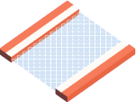
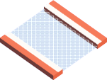
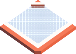
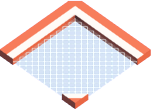
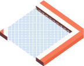
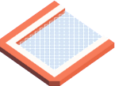
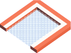
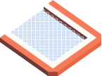
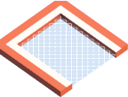

# Level file format

Each field on map is represented by `[...]`, where `...` are one of the below. Rows are y-axis, columns – x-axis. Whitespace characters are ignored (inside and outside of brackets).

 – "vertical track" – `[|]`

 – "horizontal track" – `[-]`

 – "up-right turn" – `[\_]`

 – "left-up turn" – `[_/]`

 – "down-right turn" – `[/~]`

 – "left-down turn" – `[~\]`

Vertical and horizontal fields which aren't connected from one side will be replaced with one of the following:

Empty space can be achieved with `[x]`.

## Special modifiers

Vertical and horizontal tracks can be set to be a start or finish point (only one of each): `[|s]`, `[|f]`, `[-s]`, `[-f]`.
